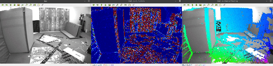

# VITAMIN-E

attempt to implement VITAMIN-E SLAM (not finished yet...)

## Dependencies

* OpenCV with contrib
* Eigen
* Sophus
* OpenGV
* Ceres or g2o (not implemented yet)

## Progress

* Estimate affine transform - DONE
* Dense tracking - DONE  
    
    
  * top left : original image
  * top right : curvature image showed by cv::COLORMAP_JET (BLUE(0) -> RED(255))
  * bottom left : dense tracking showed by HSV (degree from 2d vector, 255, 255)

## TODO

* Triangulation
* Initialize by P3P
* Bundle Adjustment
* TSDF

## Reference

https://unit.aist.go.jp/hcmrc/mr-rt/papers/published/VITAMIN-E_CVPR2019.pdf
https://github.com/gaoxiang12/slambook2